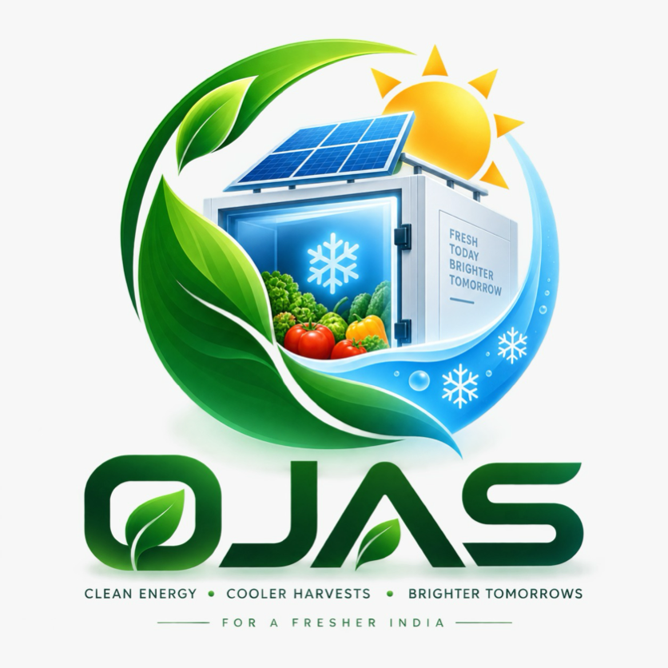

# ❄️ Smart Cold Storage (Smart Farmer Assistant Mobile App)

**AI-Powered Wind Energy Cold Storage for Farmers**

Built with **React Native + Expo + TypeScript**, designed as a mobile-first product for smallholder farmers and agricultural cold-storage operators.



---

## ⚡ Core Concept.

```
🌬 WIND TURBINE (VAWT)
      ↓
⚡ ENERGY GENERATION (2.4 kW)
      ↓
🔋 BATTERY STORAGE (82% LiFePO4)
      ↓
❄ COOLING COMPRESSOR (4.8°C)
      ↓
📦 COLD STORAGE CHAMBER (500 kg)
      ↓
🥬 CROP PRESERVATION (6x - 10x Life Extension)
      ↓
🤖 AI FARMER ASSISTANT & ADVISORY
```

---

## 📱 How to Run on Your Mobile Device

### Step 1: Install Dependencies
```bash
npm install
```

### Step 2: Start the Expo Development Server
```bash
npx expo start
```
*(or `npm start`)*

### Step 3: Connect with Your Mobile Phone
- **iOS / iPhone**: Open the default **Camera app**, point it at the QR code in the terminal, and tap **"Open in Expo Go"**.
- **Android**: Open the **Expo Go app**, tap **"Scan QR code"**, and scan the QR code.
- **Web Browser Preview**: Press `w` in the terminal to view in browser.

---

## 🌟 15 Complete Mobile Screens & Modules

1. **Splash Screen**: Animated ecosystem flow `Wind → Energy → Battery → Cooling → Crops`.
2. **Onboarding**: 3 stepped farmer-friendly onboarding cards (Harvest Protection, Wind Power, AI Assistant).
3. **Login / Mobile Auth**: Phone number + 6-digit OTP mock verification (API-ready).
4. **Home Dashboard**: Storage Health (98%), 4 Sensor Cards (Temp 4.8°C, Humidity 72%, Capacity 68%, Battery 82%), Live Energy Card with animated flow, Quick Actions, and AI Recommendation.
5. **My Cold Storage**: 3 Micro-climate zones (Zones A, B, C), setpoint adjuster, turbo cooling boost, and 4 subsystem diagnostic monitors.
6. **Digital Twin**: Interactive 2.5D visual representation of the entire system (VAWT rotor, MPPT inverter, battery bank, compressor, chamber, sensors) with tap-to-inspect bottom sheet.
7. **Inventory Management**: Crop catalog (Tomato, Potato, Onion, Carrot, Cauliflower, Apple, Green Peas) with Freshness %, Shelf Life countdowns, and filters.
8. **Add Crop Modal**: Register new harvest batches into storage with rack allocation.
9. **Crop Details Screen**: In-depth health diagnostics, loss reduction %, market value, and AI agronomist selling timing advice.
10. **Energy Management**: Live generation vs consumption, battery SOC curves, and interactive SVG charts (Daily/Weekly/Monthly).
11. **Analytics Hub**: 5 Interactive tabs (Temperature, Humidity, Energy, Storage, Economic Savings breakdown).
12. **Alerts Center**: Critical, Warning, and Info severity levels with Mark as Read & Clear All actions.
13. **AI Farmer Assistant**: Multilingual ChatGPT-style farmer assistant (Hindi, English, Hinglish) with speech mic visualizer and prompt chips.
14. **Smart Recommendations**: High, Medium, and Low priority actionable advice.
15. **Farmer Profile & Settings**: Farm details, cold storage specifications, language switcher, unit toggles, and offline sync.

---

## 🏆 Judge Presentation Demo Mode (SIH / Hackathon)

Tap **"Judge Demo Mode"** on the Home screen or in Settings to launch an automated/interactive 10-step evaluation sequence:
1. **Normal Storage Baseline** (4.8°C)
2. **Wind Generation Surge** (2.4 kW)
3. **Battery Charging** (72% → 82%)
4. **Cooling Compressor Active** (4.8°C stable)
5. **New Harvest Stored** (Tomato 120 kg)
6. **AI Spectral Vision Diagnostic** (92% freshness)
7. **AI Market Selling Timing Advice** ("Sell within 5 days")
8. **Simulated Heat Spike** (7.2°C)
9. **Critical Alert Dispatched**
10. **Automated Thermal Recovery** (4.9°C restored)
